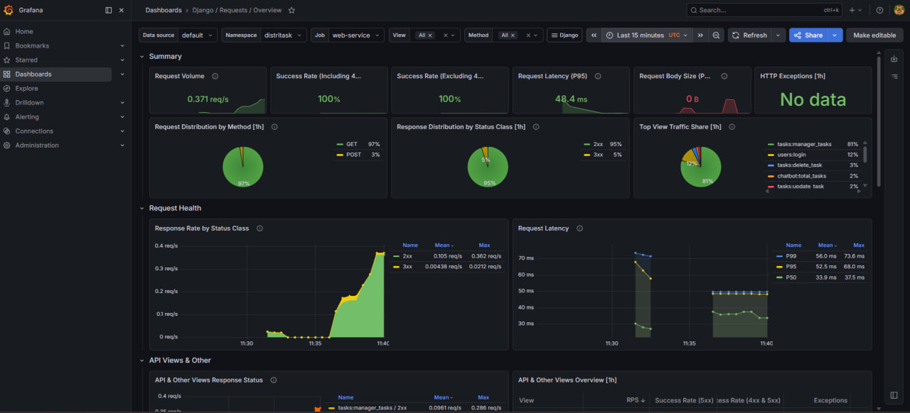

# DistriTask — Full-Stack Task Management, Containerized & Orchestrated

**DistriTask** is a portfolio-grade, full-stack task management system that demonstrates end-to-end **DevOps practice**: 
- **Local**: Docker / Docker Compose containerization for rapid development  
- **Clustered**: K3s (Kubernetes) orchestration with 12-factor config, persistence, and real-world networking  
- **Observable**: Prometheus/Grafana/Alertmanager stack with Telegram incident routing  
- **Automated**: GitHub Actions CI pipeline (build, test, push) + ArgoCD GitOps CD with Kustomize-driven image updates


---

## Table of Contents

1. [Visual Proof](#visual-proof) — Screenshots of the running system  
2. [Architecture Overview](#architecture-overview) — The four-service design  
3. [Phase 1: Docker & Docker Compose](#phase-1--docker--docker-compose-) — Local development  
4. [Phase 2: Kubernetes (K3s)](#phase-2--kubernetes-k3s-) — Cluster deployment  
5. [Phase 3: Monitoring & Alerting](#phase-3--monitoring--alerting-) — Observability stack  
6. [Phase 4: CI/CD with GitHub Actions, Kustomize & ArgoCD](#phase-4--cicd-with-github-actions-kustomize--argocd-) — GitOps automation  
7. [Complete Deployment Guide](#complete-deployment-guide) — Step-by-step K3s + Monitoring  
8. [Operations & Troubleshooting](#operations--troubleshooting) — Common tasks and fixes  
9. [Repository Structure](#repository-structure) — File layout and purpose  
10. [Security & Best Practices](#security--best-practices) — Notes for production  
11. [Author & License](#author)

---

## Visual Proof

### Running on K3s via NodePort

DistriTask is served from the Kubernetes cluster via a **NodePort** service (e.g. `http://<node-ip>:32415`). The application is fully functional with all services (Django web, Celery worker, Redis, MySQL) running in the cluster.


### Cluster Health

All workloads in namespace `distritask` are **Running**:  
- **4 application pods**: web (Django), celery (background worker), mysql (database), redis (message broker)
- **ClusterIP services** for internal communication (mysql-service, redis-service)  
- **NodePort service** for external HTTP access (web-service)
- **Monitoring stack**: Prometheus, Grafana, Alertmanager, exporters

```
$ kubectl get pods -n distritask
NAME                                                      READY   STATUS    RESTARTS   AGE
celery-deploy-7c4f78c998-dqvgr                           1/1     Running   1          24m
mysql-deploy-598cf4f5d98-vb8f8                           1/1     Running   1          24m
redis-deploy-66f68997fd-bttlf                            1/1     Running   1          24m
web-deploy-868b97dcdf-7dxmb                              1/1     Running   2          24m
alertmanager-monitoring-stack-kube-prom-alertmanager-0  2/2     Running   2 (7m)     24m
monitoring-stack-grafana-58b6ccc8fc-n4tvl               3/3     Running   0          4m
monitoring-stack-kube-prom-operator-7bdd78bb8f-kqbhf    1/1     Running   0          4m
monitoring-stack-kube-state-metrics-5559474547-sdd6h    1/1     Running   0          4m
monitoring-stack-prometheus-node-exporter-dgtcz         1/1     Running   0          4m
mysql-exporter-8786d6d98-6xw7l                          1/1     Running   1          24m
prometheus-monitoring-stack-kube-prom-prometheus-0      2/2     Running   0          4m
```

### Grafana Dashboard

Prometheus scrapes metrics from the application and MySQL exporter, and Grafana visualizes request volume, success rates, latency, and error tracking.



---

## Architecture Overview

DistriTask uses a **four-tier microservices architecture** that remains identical in Docker Compose and Kubernetes, ensuring consistent development and production deployments.

### Core Services

| Service | Role | Tech Stack | Persistence |
|---------|------|-----------|---|
| **Django Web** | HTTP UI and REST API; database migrations & seed data on startup | Django 3+, Python 3.9, Gunicorn | N/A (stateless) |
| **Celery Worker** | Asynchronous background job processing (same codebase as web) | Celery, Python 3.9 | N/A (state in Redis/MySQL) |
| **Redis** | Message broker for Celery; in-memory data store | Redis Alpine | Ephemeral (lost on pod restart) |
| **MySQL 8** | Primary relational database; persistent across restarts | MySQL 8, InnoDB | PersistentVolume (K8s) / docker volume (Compose) |

### Design Principles

1. **Single image for web + celery** — Both services use the same `Dockerfile` and dependencies. Commands are injected by the orchestrator (Compose or K8s).
2. **Service discovery via DNS** — Kubernetes uses service names (`mysql-service`, `redis-service`); Compose uses service names (`db`, `redis`).
3. **Configuration externalization** — Environment variables and secrets injected at runtime, not baked into the image.
4. **Deterministic startup** — On first boot, the web service runs `migrate → add_data → runserver` to ensure schema is ready.

### Data Flow

```
User Browser
    ↓
[NodePort Service] (K8s) / [Port 8000] (Compose)
    ↓
[Django Web Pod / Container]
    ├─→ Reads/writes to [MySQL Service / Container]
    └─→ Publishes jobs to [Redis Service / Container]
           ↓
        [Celery Worker Pod / Container] (processes async tasks)
           ↓
           Returns results to MySQL
```

---

## Phase 1 — Docker & Docker Compose 🐳

### Goal

Containerize the full Django + Celery + Redis + MySQL stack into a single **reproducible, portable** local development environment that works identically on any machine with Docker installed.

### Challenges & Solutions

#### 1. Database Readiness (Race Condition)

**Problem:** Django and Celery start faster than MySQL. If they try to connect before MySQL is ready, migrations fail and the app crashes.

**Solution:** 
- Add a `healthcheck` to the MySQL service that runs `mysqladmin ping` every 10 seconds
- Configure `web` and `celery` services with `depends_on: db: condition: service_healthy`
- This ensures nothing touches the database until MySQL confirms it is accepting connections

#### 2. Image Bloat

**Problem:** Using `python:3.9` (full image with build tools) adds ~1GB; rebuilds are slow.

**Solution:**
- Use `python:3.9-slim` base image (~200MB)
- Install only required system packages (`gcc`, `default-libmysqlclient-dev`, `pkg-config`) in a single layer
- Clean up apt cache with `rm -rf /var/lib/apt/lists/*` to trim unused files from layers

#### 3. Avoiding Duplicate Dockerfiles

**Problem:** Web and Celery need different startup commands (`runserver` vs `celery worker`). Naively, this requires separate images or messy conditional logic.

**Solution:**
- One unified `dockerfile` with **no fixed `CMD`**
- Docker Compose specifies `command` per service
- Kubernetes pods specify `command` and `args` in the deployment
- Both orchestrators inject their own startup commands

#### 4. Deterministic Schema on Startup

**Problem:** If migrations haven't run yet, the app fails with "table not found" errors.

**Solution:**
- Web service command: `python manage.py migrate && python manage.py add_data && python manage.py runserver 0.0.0.0:8000`
- Migrations and seed data run before the server listens on port 8000
- Subsequent restarts skip unchanged migrations (idempotent)

### The Dockerfile

Located at the repository root: `dockerfile`

```dockerfile
FROM python:3.9-slim

WORKDIR /app

# Install system dependencies (gcc for compiled Python packages, libmysqlclient for mysql-connector)
RUN apt-get update \
    && apt-get install -y gcc default-libmysqlclient-dev pkg-config \
    && rm -rf /var/lib/apt/lists/*

# Python settings to prevent buffering and .pyc generation
ENV PYTHONDONTWRITEBYTECODE=1
ENV PYTHONUNBUFFERED=1

# Upgrade pip
RUN pip install --upgrade pip

# Copy and install Python dependencies
COPY requirements.txt /app/
RUN pip install --no-cache-dir -r requirements.txt

# Copy application code
COPY . /app/

# Expose port (used by web service; celery doesn't need this)
EXPOSE 8000

# CMD omitted — orchestrator (Compose / Kubernetes) provides the command
```

### Docker Compose Orchestration

Located at repository root: `docker-compose.yml`

```yaml
version: '3.8'

services:
  db:
    image: mysql:8
    environment:
      MYSQL_DATABASE: mydatabase
      MYSQL_USER: myuser
      MYSQL_PASSWORD: mypassword
      MYSQL_ROOT_PASSWORD: myrootpassword
    volumes:
      - mysql_data:/var/lib/mysql
    healthcheck:
      test: ["CMD", "mysqladmin", "ping", "-h", "localhost", "-u", "root", "-p$$MYSQL_ROOT_PASSWORD"]
      interval: 10s
      timeout: 5s
      retries: 5

  redis:
    image: redis:alpine

  web:
    build: .
    command: >
      sh -c "python manage.py migrate &&
             python manage.py add_data &&
             python manage.py runserver 0.0.0.0:8000"
    volumes:
      - .:/app
    ports:
      - "8000:8000"
    environment:
      - MYSQL_DATABASE=mydatabase
      - MYSQL_USER=myuser
      - MYSQL_PASSWORD=mypassword
      - DB_HOST=db
      - CELERY_BROKER_URL=redis://redis:6379/0
    depends_on:
      db:
        condition: service_healthy
      redis:
        condition: service_started
    restart: on-failure

  celery:
    build: .
    command: ["celery", "-A", "TaskManager", "worker", "--loglevel=info"]
    volumes:
      - .:/app
    environment:
      - MYSQL_DATABASE=mydatabase
      - MYSQL_USER=myuser
      - MYSQL_PASSWORD=mypassword
      - DB_HOST=db
      - CELERY_BROKER_URL=redis://redis:6379/0
    depends_on:
      db:
        condition: service_healthy
      redis:
        condition: service_started
    restart: on-failure

volumes:
  mysql_data:
```

### Quick Start (Local Development)

```bash
# Build images and start all services
docker compose up --build

# On first run: Django runs migrations, loads seed data, then starts the server
# App is ready at: http://localhost:8000

# Stop services (Ctrl+C or in another terminal)
docker compose down

# View logs for a specific service
docker compose logs -f web
docker compose logs -f celery
docker compose logs -f db
```

**Docker Compose V1 (older Docker):**  
```bash
docker-compose up --build  # instead of docker compose
```

### Common Local Development Tasks

```bash
# Create Django migrations
docker compose exec web python manage.py makemigrations

# Run Django shell
docker compose exec web python manage.py shell

# Access MySQL directly
docker compose exec db mysql -u myuser -pmypassword mydatabase

# Restart a service (e.g., after code changes)
docker compose restart web

# Clean up everything (remove containers, volumes, networks)
docker compose down -v
```

---

## Phase 2 — Kubernetes (K3s) ☸️

### Goal

Deploy the same multi-service architecture on a lightweight Kubernetes cluster (K3s) using manifests that implement 12-factor principles: isolated namespace, externalized config, secrets, persistent storage, and service discovery.

### K3s Prerequisites

If you don't have K3s running yet:

```bash
# Install K3s on Ubuntu/Debian (lightweight Kubernetes)
curl -sfL https://get.k3s.io | sh -

# Verify installation
kubectl cluster-info
kubectl get nodes
```

### Kubernetes Objects & Strategy

This project organizes K8s manifests in `k8s/` with the following structure:

| Concern | File(s) | Purpose |
|---------|---------|---------|
| **Namespace** | `k8s/namespace.yaml` | Isolate app resources under `distritask` namespace |
| **ConfigMap** | `k8s/configmap.yaml` | Non-secret config (DB host, Redis URL, database name) |
| **Secrets** | `k8s/secret.yaml` | MySQL passwords, Base64-encoded at rest |
| **Storage** | `k8s/pvc.yaml` | PersistentVolumeClaim for MySQL data (1Gi) |
| **Data Services** | `k8s/mysql-deploy.yaml`, `k8s/redis-deploy.yaml` | MySQL and Redis deployments |
| **Data Services (Services)** | `k8s/sql-service.yaml`, `k8s/redis-service.yaml` | ClusterIP services for stable DNS names |
| **App Services** | `k8s/web-deploy.yaml`, `k8s/celery-deploy.yaml` | Django web and Celery worker deployments |
| **Monitoring** | `k8s/distritask-monitor.yaml`, `k8s/mysql-monitor.yaml` | ServiceMonitors for Prometheus scraping |
| **Exporter** | `k8s/mysql-exporter-deployment.yaml` | MySQL metrics exporter |
| **Rules & Alerts** | `k8s/rules/django-web-rules.yaml`, `k8s/rules/mysql-rule.yaml`, `k8s/rules/telegram-alertmanager.yaml` | AlertingRules and Alertmanager routing |

### Key Kubernetes Manifests

#### 1. Namespace — Isolation

`k8s/namespace.yaml` — Isolates all project resources:

```yaml
apiVersion: v1
kind: Namespace
metadata:
  name: distritask
```

#### 2. ConfigMap — Configuration

`k8s/configmap.yaml` — Non-secret environment variables for all services:

```yaml
apiVersion: v1
kind: ConfigMap
metadata:
  name: backend-config
  namespace: distritask
data:
  DB_HOST: mysql-service          # DNS name of MySQL service
  MYSQL_DATABASE: mydatabase
  MYSQL_USER: myuser
  CELERY_BROKER_URL: redis://redis-service:6379/0  # DNS name of Redis service
```

#### 3. Secrets — Credentials

`k8s/secret.yaml` — Credentials (replace with real values before deploy):

```yaml
apiVersion: v1
kind: Secret
metadata:
  name: my-secret
  namespace: distritask
type: Opaque
stringData:
  MYSQL_PASSWORD: mypassword
  MYSQL_ROOT_PASSWORD: myrootpassword
```

**Security note:** Replace values before committing. Use encrypted secrets in production.

#### 4. PersistentVolumeClaim — Storage

`k8s/pvc.yaml` — Persistent storage for MySQL:

```yaml
apiVersion: v1
kind: PersistentVolumeClaim
metadata:
  name: mysql-pvc
  namespace: distritask
spec:
  accessModes:
    - ReadWriteOnce
  resources:
    requests:
      storage: 1Gi
```

#### 5. MySQL Deployment

`k8s/mysql-deploy.yaml` — Stateful MySQL database with persistent volume:

```yaml
apiVersion: apps/v1
kind: Deployment
metadata:
  name: mysql-deploy
  namespace: distritask
spec:
  replicas: 1
  selector:
    matchLabels:
      app: mysql
  template:
    metadata:
      labels:
        app: mysql
    spec:
      containers:
      - name: mysql
        image: mysql:8
        ports:
        - containerPort: 3306
        envFrom:
        - secretRef:
            name: my-secret
        - configMapRef:
            name: backend-config
        volumeMounts:
        - name: mysql-storage
          mountPath: /var/lib/mysql
        livenessProbe:
          exec:
            command:
            - /bin/sh
            - -c
            - mysqladmin ping -h 127.0.0.1 -u root -p$$MYSQL_ROOT_PASSWORD
          initialDelaySeconds: 30
          periodSeconds: 10
      volumes:
      - name: mysql-storage
        persistentVolumeClaim:
          claimName: mysql-pvc
```

#### 6. Service Discovery

`k8s/sql-service.yaml` — ClusterIP service for MySQL:

```yaml
apiVersion: v1
kind: Service
metadata:
  name: mysql-service
  namespace: distritask
spec:
  selector:
    app: mysql
  type: ClusterIP
  ports:
  - port: 3306
    targetPort: 3306
```

`k8s/redis-service.yaml` and `k8s/redis-deploy.yaml` — Follow the same pattern as MySQL.

#### 7. Django Web Deployment

`k8s/web-deploy.yaml` — Web tier with migrations & seed data on startup:

```yaml
apiVersion: apps/v1
kind: Deployment
metadata:
  name: web-deploy
  namespace: distritask
spec:
  replicas: 1
  selector:
    matchLabels:
      app: web-deploy
  template:
    metadata:
      labels:
        app: web-deploy
    spec:
      containers:
      - name: distritask
        image: ahmedr0001/distritask:v2
        command: ["sh", "-c"]
        args: 
        - "python manage.py migrate && python manage.py add_data && python manage.py runserver 0.0.0.0:8000"
        ports:
        - containerPort: 8000
        envFrom:
        - configMapRef:
            name: backend-config
        - secretRef:
            name: my-secret
        livenessProbe:
          httpGet:
            path: /
            port: 8000
          initialDelaySeconds: 30
          periodSeconds: 10
```

#### 8. Celery Worker Deployment

`k8s/celery-deploy.yaml` — Background job processor (same image as web):

```yaml
apiVersion: apps/v1
kind: Deployment
metadata:
  name: celery-deploy
  namespace: distritask
spec:
  replicas: 1
  selector:
    matchLabels:
      app: celery-deploy
  template:
    metadata:
      labels:
        app: celery-deploy
    spec:
      containers:
      - name: distritask
        image: ahmedr0001/distritask:v2
        command: ["celery", "-A", "TaskManager", "worker", "--loglevel=info"]
        envFrom:
        - configMapRef:
            name: backend-config
        - secretRef:
            name: my-secret
```

### Build and Import the Docker Image

K3s uses containerd internally. To use a locally-built image without pushing to a registry:

```bash
# Build the Docker image
docker build -t ahmedr0001/distritask:v2 .

# Export as tarball
docker save ahmedr0001/distritask:v2 -o distritask.tar

# Import into K3s's containerd (on the K3s node)
sudo k3s ctr images import distritask.tar

# Verify
sudo k3s ctr images ls | grep distritask
```

**Alternative:** Use `imagePullPolicy: Never` in the deployment to tell K8s not to fetch from a registry (already set in the repo manifests).

### Service Exposure (NodePort)

After all core services are running, expose the Django web application externally via a NodePort:

```bash
kubectl expose deployment web-deploy \
  --name=web-service \
  --type=NodePort \
  --port=8000 \
  --target-port=8000 \
  --namespace=distritask
```

Find the assigned port:

```bash
kubectl get svc -n distritask

# Output example:
# NAME           TYPE       CLUSTER-IP      EXTERNAL-IP   PORT(S)          AGE
# mysql-service  ClusterIP  10.43.165.100   <none>        3306/TCP         2m
# redis-service  ClusterIP  10.43.45.123    <none>        6379/TCP         2m
# web-service    NodePort   10.43.200.50    <none>        8000:32415/TCP   10s
```

Then access the app at: `http://<node-ip>:32415`

---

## Phase 3 — Monitoring & Alerting 📊

### Goal

Add observability to the cluster: collect metrics from the application and infrastructure, visualize them in Grafana, and route critical alerts to Telegram for incident response.

### Architecture

The monitoring stack uses:
- **Prometheus** — Time-series database and metrics collection engine
- **Prometheus Operator** — Kubernetes-native management of Prometheus, AlertManager, and ServiceMonitors
- **Grafana** — Metrics visualization and dashboarding
- **Alertmanager** — Routing and aggregation of alerts to receivers (Telegram, Slack, etc.)
- **MySQL Exporter** — Exposes MySQL metrics to Prometheus
- **Django app metrics** — Application endpoints that expose Prometheus metrics (via `/metrics` endpoint)

### Monitoring Files in This Repo

| File | Purpose |
|------|---------|
| `k8s/distritask-monitor.yaml` | ServiceMonitor for Django web service (`/metrics` endpoint) |
| `k8s/mysql-exporter-deployment.yaml` | Deployment for MySQL exporter container |
| `k8s/mysql-monitor.yaml` | ServiceMonitor for MySQL exporter metrics |
| `k8s/rules/django-web-rules.yaml` | PrometheusRules for alerting on Django exceptions & errors |
| `k8s/rules/mysql-rule.yaml` | PrometheusRules for MySQL health (uptime, connections, etc.) |
| `k8s/rules/telegram-alertmanager.yaml` | AlertmanagerConfig that routes alerts to Telegram |
| `k8s/alertmanager/alertmanager-values.yaml` | Example Helm values for Alertmanager configuration |
| `grafana-secret.sh` | Helper script to retrieve Grafana admin password |

### ServiceMonitor Examples

#### Django Web ServiceMonitor

`k8s/distritask-monitor.yaml` — Tells Prometheus to scrape the web service:

```yaml
apiVersion: monitoring.coreos.com/v1
kind: ServiceMonitor
metadata:
  name: distritask-backend-monitor
  namespace: distritask
  labels:
    release: monitoring-stack  # for prometheus-operator to discover this ServiceMonitor
spec:
  namespaceSelector:
    matchNames:
      - distritask 
  selector:
    matchLabels:
      app: web-deploy
  endpoints:
  - port: web
    path: /metrics
    interval: 15s
```

#### MySQL Exporter ServiceMonitor

`k8s/mysql-monitor.yaml` — Tells Prometheus to scrape the MySQL exporter:

```yaml
apiVersion: monitoring.coreos.com/v1
kind: ServiceMonitor
metadata:
  name: mysql-exporter-monitor
  namespace: distritask       
  labels:
    release: monitoring-stack
spec:
  namespaceSelector:
    matchNames:
      - distritask
  selector:
    matchLabels:
      app: mysql-exporter
  endpoints:
  - port: metrics
    path: /metrics
    interval: 15s
```

### Alerting Rules

#### Django Application Alerts

`k8s/rules/django-web-rules.yaml` — Fires alert when exception rate spikes:

```yaml
apiVersion: monitoring.coreos.com/v1
kind: PrometheusRule
metadata:
  name: django-app-alerts
  namespace: distritask
  labels:
    release: monitoring-stack
spec:
  groups:
  - name: DjangoApp.rules
    rules:
    - alert: DjangoExceptionsSpike
      expr: rate(django_http_exceptions_total_by_view_total[5m]) > 1
      for: 15s
      labels:
        severity: critical
      annotations:
        summary: "Django Application Exceptions Detected!"
        description: "The Django application is throwing exceptions in the view: {{ $labels.view }} on instance {{ $labels.instance }}. Check the application logs."
```

#### MySQL Alerts

`k8s/rules/mysql-rule.yaml` — Monitors MySQL health:

```yaml
apiVersion: monitoring.coreos.com/v1
kind: PrometheusRule
metadata:
  name: mysql-alerts
  namespace: distritask
  labels:
    release: monitoring-stack
spec:
  groups:
  - name: MySQL.rules
    rules:
    - alert: MySQLDown
      expr: mysql_up == 0
      for: 1m
      labels:
        severity: critical
      annotations:
        summary: "MySQL is down"
        description: "MySQL instance {{ $labels.instance }} is unreachable."
```

### Alertmanager Configuration (Telegram)

`k8s/rules/telegram-alertmanager.yaml` — Routes `severity=critical` alerts to Telegram:

```yaml
apiVersion: monitoring.coreos.com/v1alpha1
kind: AlertmanagerConfig
metadata:
  name: telegram-config
  namespace: distritask
  labels:
    release: monitoring-stack
spec:
  route:
    groupBy: ['job']
    groupWait: 30s
    groupInterval: 5m
    repeatInterval: 12h
    receiver: 'Telegram-Alerts'
    matchers:
      - name: severity
        matchType: "="
        value: critical
  receivers:
    - name: Telegram-Alerts
      telegramConfigs:
        - chatID: 855708276
          parseMode: 'HTML'
          disableNotifications: false
          sendResolved: true
          botToken:
            name: telegram-bot-token-secret
            key: token
```

---

## Phase 4 — CI/CD with GitHub Actions, Kustomize & ArgoCD 🚀

### Goal

Close the loop between code and cluster by adding a fully automated **GitOps pipeline**:
- Every push to `main` triggers a **GitHub Actions CI workflow** that builds a fresh Docker image, tags it deterministically, and pushes it to Docker Hub.
- The workflow then uses **Kustomize** to bump the image tag inside `k8s/kustomization.yaml` and commits the change back to the repository.
- **ArgoCD** continuously watches the `k8s/` directory in the repo; when the kustomization changes, it automatically reconciles the cluster to the new desired state (`prune: true`, `selfHeal: true`).

The result: a `git push` is the only manual step needed to ship a new version to the K3s cluster.

### Pipeline Architecture

```
Developer
    │  git push origin main
    ▼
[ GitHub Actions: DistriTask CI Pipeline ]
    ├─ Checkout code
    ├─ Set up Python 3.9 & install deps
    ├─ docker login → Docker Hub
    ├─ Compute CUSTOM_VERSION = run_number + 2
    ├─ docker buildx build & push
    │     ├─ ahmedr0001/distritask:latest
    │     ├─ ahmedr0001/distritask:v<CUSTOM_VERSION>
    │     └─ ahmedr0001/distritask:<git-sha>
    └─ kustomize edit set image ... :v<CUSTOM_VERSION>
          └─ git commit & push k8s/kustomization.yaml
                  │
                  ▼
            [ Git Repository (main) ]
                  │  polled / webhook
                  ▼
            [ ArgoCD Application: distritask-app ]
                  ├─ source: repo path = k8s/   (Kustomize)
                  ├─ destination: cluster, namespace = distritask
                  └─ syncPolicy: automated (prune + selfHeal)
                  │
                  ▼
            [ K3s Cluster — Reconciled ]
              Deployments roll out new image automatically
```

### CI — GitHub Actions Workflow

Located at `.github/workflows/CI.yaml`. It runs on every push to `main` and performs build → push → manifest update in a single job:

```yaml
name: DistriTask CI Pipeline

on:
  push:
    branches:
      - main

permissions:
  contents: write

jobs:
  buildAndTest:
    runs-on: ubuntu-latest
    steps:
      - name: Checkout Code
        uses: actions/checkout@v4

      - name: Set up Python
        uses: actions/setup-python@v5
        with:
          python-version: '3.9'

      - name: Install Dependencies
        run: pip install -r requirements.txt

      # - name: Run Django Tests
      #   run: python manage.py test

      - name: Login to Docker Hub
        uses: docker/login-action@v3
        with:
          username: ${{ secrets.DOCKERHUB_USERNAME }}
          password: ${{ secrets.DOCKERHUB_TOKEN }}

      - name: Set Custom Version
        run: echo "CUSTOM_VERSION=$((${{ github.run_number }} + 2))" >> $GITHUB_ENV

      - name: Build and Push Docker Image
        uses: docker/build-push-action@v5
        with:
          context: .
          push: true
          tags: |
            ahmedr0001/distritask:latest
            ahmedr0001/distritask:v${{ env.CUSTOM_VERSION }}
            ahmedr0001/distritask:${{ github.sha }}

      - name: Update Image Tag with Kustomize
        run: |
          cd k8s
          kustomize edit set image ahmedr0001/distritask=ahmedr0001/distritask:v${{ env.CUSTOM_VERSION }}
          git config --global user.name "github-actions[bot]"
          git config --global user.email "github-actions[bot]@users.noreply.github.com"
          git add kustomization.yaml
          git commit -m "Update image tag to v${{ env.CUSTOM_VERSION }} via Kustomize"
          git push
```

#### Required GitHub Secrets

The workflow needs the following repository secrets configured under **Settings → Secrets and variables → Actions**:

| Secret | Purpose |
|--------|---------|
| `DOCKERHUB_USERNAME` | Docker Hub account name (e.g. `ahmedr0001`) |
| `DOCKERHUB_TOKEN` | Docker Hub Personal Access Token with read/write/delete on repos |

The job also relies on the default `GITHUB_TOKEN` (granted via `permissions: contents: write`) so the workflow can commit the kustomization update back to `main`.

#### Image Tagging Strategy

Each successful build publishes three tags so consumers can pin to any precision level:

- `latest` — moving tag, points to the most recent successful build (convenient, not for prod pinning)
- `v<CUSTOM_VERSION>` — monotonically increasing version derived from `github.run_number + 2`; this is the tag Kustomize writes into the manifests and ArgoCD eventually deploys
- `<git-sha>` — immutable commit hash tag for forensic traceability

### Kustomize — Single Source of Truth for Manifests

Instead of patching individual Deployment YAMLs every release, all K8s manifests are aggregated through Kustomize. The kustomization file (`k8s/kustomization.yaml`) lists every resource and pins the application image tag in one place — that's the only line CI rewrites per release.

```yaml
apiVersion: kustomize.config.k8s.io/v1beta1
kind: Kustomization

resources:
- celery-deploy.yaml
- configmap.yaml
- distritask-monitor.yaml
- mysql-deploy.yaml
- mysql-exporter-deployment.yaml
- mysql-monitor.yaml
- namespace.yaml
- pvc.yaml
- redis-deploy.yaml
- redis-service.yaml
- secret.yaml
- sql-service.yaml
- web-deploy.yaml
- web-service.yaml
- rules/telegram-alertmanager.yaml
- rules/mysql-rule.yaml
- rules/django-web-rules.yaml
- rules/telegram-secret.yaml

images:
- name: ahmedr0001/distritask
  newName: ahmedr0001/distritask
  newTag: v9
```

Key points:
- `resources:` aggregates every manifest in `k8s/` so the whole stack can be applied with a single command.
- `images:` is the override CI manipulates via `kustomize edit set image ...`. After each successful CI run, `newTag` is updated to the freshly built version — committed back to the repo so the Git history *is* the deployment history.
- You can render the final manifests locally without applying them:
  ```bash
  kubectl kustomize k8s/
  # or apply directly:
  kubectl apply -k k8s/
  ```

### ArgoCD — GitOps Continuous Delivery

ArgoCD is the controller running inside the cluster that watches this Git repository and ensures the live state matches the manifests under `k8s/`. The Application definition lives at `argocd-setup/argocd-app.yaml`:

```yaml
apiVersion: argoproj.io/v1alpha1
kind: Application
metadata:
  name: distritask-app
  namespace: argocd
spec:
  project: default
  source:
    repoURL: https://github.com/ahmedr0001/DistriTask-K8s.git
    targetRevision: main
    path: k8s
  destination:
    server: https://kubernetes.default.svc
    namespace: distritask
  syncPolicy:
    automated:
      prune: true
      selfHeal: true
```

Highlights:
- **`path: k8s`** — ArgoCD detects the `kustomization.yaml` there and renders the manifests with Kustomize automatically (no extra plugin config required).
- **`automated.prune: true`** — Resources removed from Git are also removed from the cluster, preventing drift.
- **`automated.selfHeal: true`** — Manual `kubectl edit` changes that diverge from Git are reverted; Git is the single source of truth.
- **`destination.namespace: distritask`** — All synced resources land in the application namespace alongside the rest of the stack.

### Installing & Wiring ArgoCD

If ArgoCD is not yet installed on the cluster:

```bash
# 1) Create the argocd namespace and install the upstream manifests
kubectl create namespace argocd
kubectl apply -n argocd -f https://raw.githubusercontent.com/argoproj/argo-cd/stable/manifests/install.yaml

# 2) Wait for the ArgoCD server to be ready
kubectl wait --for=condition=available --timeout=300s \
  deployment/argocd-server -n argocd

# 3) Register the DistriTask application
kubectl apply -f argocd-setup/argocd-app.yaml

# 4) (Optional) Access the ArgoCD UI
kubectl port-forward svc/argocd-server -n argocd 8080:443
# Open https://localhost:8080
# Initial admin password:
kubectl -n argocd get secret argocd-initial-admin-secret \
  -o jsonpath="{.data.password}" | base64 -d; echo

# 5) Verify the application is syncing
kubectl get applications -n argocd
# NAME              SYNC STATUS   HEALTH STATUS
# distritask-app    Synced        Healthy
```

### End-to-End Release Flow

Once the pipeline is wired up, releasing a new version is fully hands-off:

1. **Developer** commits a code change and runs `git push origin main`.
2. **GitHub Actions** builds the image, pushes `ahmedr0001/distritask:v<N>` to Docker Hub, and commits an updated `k8s/kustomization.yaml` (new `newTag`).
3. **ArgoCD** notices the manifest change on the next polling cycle (or via webhook), renders Kustomize, and computes a diff against the cluster.
4. **ArgoCD** applies the diff — typically only the `web-deploy` and `celery-deploy` Deployments — and Kubernetes performs a rolling update to the new image.
5. **Prometheus & Grafana** keep monitoring; if the new build misbehaves, alerts route to Telegram per Phase 3.

If something goes wrong, rollback is just a `git revert` of the kustomization commit — ArgoCD will then sync the cluster back to the previous image.

---

## Complete Deployment Guide

### Quick Start: All Four Phases

This section walks through deploying everything from scratch.

#### Prerequisites

- Docker and Docker Compose installed (for Phase 1)
- K3s cluster running (Phase 2)
- `kubectl` configured for the K3s cluster
- `helm` (v3+) installed
- `kustomize` (v4+) installed (for Phase 4 / GitOps usage)
- ArgoCD installed in the cluster (for Phase 4 — see installation steps in Phase 4)

#### Phase 1: Docker Compose (Local Testing)

```bash
# Navigate to repo root
cd /path/to/DistriTask-K8s

# Start local stack
docker compose up --build

# Access app at http://localhost:8000
# Ctrl+C to stop

# Clean up
docker compose down -v
```

#### Phase 2: Kubernetes (K3s Cluster)

**Step 1: Build & import the application image**

```bash
# On your development machine
docker build -t ahmedr0001/distritask:v2 .
docker save ahmedr0001/distritask:v2 -o distritask.tar

# Transfer distritask.tar to the K3s node, then:
# ssh into the K3s node
sudo k3s ctr images import distritask.tar
```

**Step 2: Apply Kubernetes manifests (sequential order matters)**

```bash
# 1) Namespace, config, secrets, storage
kubectl apply -f k8s/namespace.yaml
kubectl apply -f k8s/configmap.yaml
kubectl apply -f k8s/secret.yaml
kubectl apply -f k8s/pvc.yaml

# 2) Data layer & messaging + Services
kubectl apply -f k8s/mysql-deploy.yaml
kubectl apply -f k8s/redis-deploy.yaml
kubectl apply -f k8s/sql-service.yaml
kubectl apply -f k8s/redis-service.yaml

# 3) Application tier
kubectl apply -f k8s/web-deploy.yaml
kubectl apply -f k8s/celery-deploy.yaml

# 4) Expose Django (NodePort)
kubectl expose deployment web-deploy \
  --name=web-service \
  --type=NodePort \
  --port=8000 \
  --target-port=8000 \
  --namespace=distritask

# Verify everything is running
kubectl get pods -n distritask
kubectl get svc -n distritask

# Get the NodePort URL
NODE_PORT=$(kubectl get svc web-service -n distritask -o jsonpath='{.spec.ports[0].nodePort}')
NODE_IP=$(kubectl get nodes -o jsonpath='{.items[0].status.addresses[0].address}')
echo "Access app at: http://$NODE_IP:$NODE_PORT"
```

#### Phase 3: Monitoring & Alerting

**Step 1: Add Prometheus Helm repo**

```bash
helm repo add prometheus-community https://prometheus-community.github.io/helm-charts
helm repo update
```

**Step 2: Install kube-prometheus-stack**

```bash
# Install into distritask namespace
helm upgrade --install monitoring-stack prometheus-community/kube-prometheus-stack \
  -n distritask --create-namespace --wait

# Verify
kubectl get pods -n distritask | grep monitoring
```

**Step 3: Deploy exporters and ServiceMonitors**

```bash
# MySQL exporter
kubectl apply -f k8s/mysql-exporter-deployment.yaml
kubectl apply -f k8s/mysql-monitor.yaml

# Django web ServiceMonitor
kubectl apply -f k8s/distritask-monitor.yaml

# Wait for exporters to start (check pods)
kubectl get pods -n distritask | grep exporter
```

**Step 4: Create Telegram secret and apply alerting rules**

```bash
# Create secret with your Telegram bot token (replace with real token)
kubectl create secret generic telegram-bot-token-secret \
  --from-literal=token='YOUR_TELEGRAM_BOT_TOKEN' \
  -n distritask

# Apply alerting rules and Alertmanager config
kubectl apply -f k8s/rules/django-web-rules.yaml
kubectl apply -f k8s/rules/mysql-rule.yaml
kubectl apply -f k8s/rules/telegram-alertmanager.yaml
```

**Step 5: Access Grafana**

```bash
# Port-forward Grafana
kubectl -n distritask port-forward svc/monitoring-stack-grafana 3000:80

# In another terminal, get the admin password
kubectl --namespace distritask get secret monitoring-stack-grafana -o jsonpath="{.data.admin-password}" | base64 -d; echo

# Open http://localhost:3000 and login with username=admin and the password above
```

**Step 6: Test alerting (optional)**

Create a temporary firing rule to test end-to-end alert routing:

```bash
cat <<EOF > /tmp/test-alert.yaml
apiVersion: monitoring.coreos.com/v1
kind: PrometheusRule
metadata:
  name: instant-test-alert
  namespace: distritask
  labels:
    release: monitoring-stack
spec:
  groups:
  - name: firing-test
    rules:
    - alert: InstantTestAlert
      expr: vector(1)
      for: 1m
      labels:
        severity: critical
      annotations:
        summary: "Test alert firing"
        description: "This is a test to confirm Alertmanager routing to Telegram."
EOF

kubectl apply -f /tmp/test-alert.yaml

# Wait ~1min and check your Telegram for the alert
# Then delete the test rule
kubectl delete -f /tmp/test-alert.yaml
```

#### Phase 4: CI/CD with GitHub Actions, Kustomize & ArgoCD

**Step 1: Configure GitHub repository secrets**

In the GitHub repo, go to **Settings → Secrets and variables → Actions** and add:

- `DOCKERHUB_USERNAME` — your Docker Hub username
- `DOCKERHUB_TOKEN` — a Docker Hub access token with push permission

**Step 2: Install ArgoCD into the cluster (one-time)**

```bash
kubectl create namespace argocd
kubectl apply -n argocd \
  -f https://raw.githubusercontent.com/argoproj/argo-cd/stable/manifests/install.yaml

kubectl wait --for=condition=available --timeout=300s \
  deployment/argocd-server -n argocd
```

**Step 3: Register the DistriTask ArgoCD application**

```bash
kubectl apply -f argocd-setup/argocd-app.yaml

kubectl get applications -n argocd
# distritask-app should show SYNC=Synced, HEALTH=Healthy after the first sync
```

**Step 4: Trigger an end-to-end deploy**

```bash
# Make any code change and push to main
git add .
git commit -m "feat: new release"
git push origin main

# GitHub Actions builds & pushes the image, bumps k8s/kustomization.yaml,
# and pushes that commit back. ArgoCD picks it up automatically and rolls
# out the new image to the distritask namespace.

# Watch the rollout
kubectl get pods -n distritask -w
```

**Step 5: (Optional) Access the ArgoCD UI**

```bash
kubectl port-forward svc/argocd-server -n argocd 8080:443

# Initial admin password:
kubectl -n argocd get secret argocd-initial-admin-secret \
  -o jsonpath="{.data.password}" | base64 -d; echo

# Open https://localhost:8080 and log in as admin
```

---

## Operations & Troubleshooting

### Common Commands

```bash
# Check pod status
kubectl get pods -n distritask
kubectl describe pod <pod-name> -n distritask

# View logs
kubectl logs -f deployment/web-deploy -n distritask
kubectl logs -f deployment/celery-deploy -n distritask
kubectl logs -f deployment/mysql-deploy -n distritask

# Access containers directly
kubectl exec -it deployment/web-deploy -n distritask -- bash

# Port-forward services
kubectl port-forward svc/monitoring-stack-grafana 3000:80 -n distritask
kubectl port-forward svc/monitoring-stack-prometheus 9090:9090 -n distritask

# Get service info
kubectl get svc -n distritask
kubectl describe svc web-service -n distritask
```

### Troubleshooting

#### Pods not starting / CrashLoopBackOff

```bash
# Check pod events
kubectl describe pod <pod-name> -n distritask

# Check logs
kubectl logs <pod-name> -n distritask

# Common issues:
# - Image not found: ensure docker image was imported or exists in registry
# - ConfigMap/Secret missing: verify kubectl apply was run for all config
# - MySQL not healthy: check MySQL pod logs and PVC status
```

#### Prometheus not scraping metrics

```bash
# Verify ServiceMonitor exists and has correct label
kubectl get servicemonitors -n distritask
kubectl describe servicemonitor distritask-backend-monitor -n distritask

# Check Prometheus targets UI
kubectl port-forward svc/monitoring-stack-prometheus 9090:9090 -n distritask
# Open http://localhost:9090/targets
```

#### Alerts not routing to Telegram

```bash
# Verify AlertmanagerConfig is present
kubectl get alertmanagerconfig -n distritask

# Check AlertManager UI
kubectl port-forward svc/monitoring-stack-alertmanager 9093:9093 -n distritask
# Open http://localhost:9093

# Verify Telegram secret exists
kubectl get secret telegram-bot-token-secret -n distritask
```

#### MySQL data not persisting

```bash
# Check PVC status
kubectl get pvc -n distritask
kubectl describe pvc mysql-pvc -n distritask

# Verify volume is mounted
kubectl exec -it deployment/mysql-deploy -n distritask -- ls -la /var/lib/mysql
```

---

## Repository Structure

```
DistriTask-K8s/
├── README.md                          # This file
├── dockerfile                         # Shared Docker image for web + celery
├── docker-compose.yml                 # Local development stack
├── requirements.txt                   # Python dependencies
├── manage.py                          # Django management script
├── grafana-secret.sh                  # Helper script for Grafana password
├── wait_for_db.py                     # DB readiness check
│
├── TaskManager/                       # Django project config
│   ├── settings.py
│   ├── urls.py
│   ├── wsgi.py
│   ├── asgi.py
│   ├── celery.py
│   └── ...
│
├── chat/                              # Django app: chatbot integration
├── chatbot/                           # Django app: chatbot logic
├── core/                              # Django app: core features
├── tasks/                             # Django app: task management (primary)
├── users/                             # Django app: user management
│
├── .github/
│   └── workflows/
│       └── CI.yaml                    # GitHub Actions: build, push, bump Kustomize tag
│
├── argocd-setup/
│   └── argocd-app.yaml                # ArgoCD Application manifest (GitOps source)
│
├── k8s/                               # Kubernetes manifests
│   ├── kustomization.yaml             # Kustomize entry point (resources + image tag)
│   ├── namespace.yaml                 # App namespace
│   ├── configmap.yaml                 # Non-secret configuration
│   ├── secret.yaml                    # Credentials (replace before deploy)
│   ├── pvc.yaml                       # MySQL persistent volume claim
│   ├── mysql-deploy.yaml              # MySQL deployment
│   ├── redis-deploy.yaml              # Redis deployment
│   ├── sql-service.yaml               # MySQL service (ClusterIP)
│   ├── redis-service.yaml             # Redis service (ClusterIP)
│   ├── web-deploy.yaml                # Django web deployment
│   ├── web-service.yaml               # Django web service (NodePort)
│   ├── celery-deploy.yaml             # Celery worker deployment
│   ├── distritask-monitor.yaml        # ServiceMonitor for web app
│   ├── mysql-exporter-deployment.yaml # MySQL metrics exporter
│   ├── mysql-monitor.yaml             # ServiceMonitor for MySQL exporter
│   │
│   ├── alertmanager/
│   │   └── alertmanager-values.yaml   # Helm values for Alertmanager
│   │
│   └── rules/
│       ├── django-web-rules.yaml      # PrometheusRules for Django alerts
│       ├── mysql-rule.yaml            # PrometheusRules for MySQL alerts
│       ├── telegram-alertmanager.yaml # AlertmanagerConfig routing to Telegram
│       └── telegram-secret.yaml       # Example secret for Telegram bot token
│
├── templates/                         # Django templates (HTML)
├── static/                            # Static files (CSS, JS, images)
├── Tests/                             # Test suites
├── docs/
│   └── images/
│       ├── distritask-k3s-nodeport.png        # App screenshot (NodePort)
│       ├── distritask-kubectl-get-all.png     # Cluster pods screenshot
│       └── grafana-django-dashboard.png       # Grafana metrics dashboard
│
└── .gitignore, .env, ...              # Git and environment config
```

---

## Security & Best Practices

### Secrets Management

**DO NOT commit secrets to Git:**
- The repo includes example `k8s/secret.yaml` and `k8s/rules/telegram-secret.yaml` with placeholder values.
- Before deploying to a cluster, replace all credentials:
  ```bash
  kubectl create secret generic my-secret \
    --from-literal=MYSQL_PASSWORD='<real-password>' \
    -n distritask
  ```
- Use tools like **Sealed Secrets** or **HashiCorp Vault** for production.

### RBAC & Network Policies

- This repo uses a single namespace (`distritask`) for simplicity; in production, segregate by environment (dev, staging, prod).
- Implement **NetworkPolicies** to restrict inter-pod communication.
- Use **Pod Security Policies** or **Pod Security Standards** to enforce container security.

### Image Security

- Always use specific image tags (not `latest`).
- Scan images for vulnerabilities before deployment.
- Use private registries for sensitive applications.

### Monitoring & Logging

- Prometheus retention is limited; for long-term storage, use a remote backend (e.g., Thanos, Cortex).
- Aggregate logs from all pods using tools like **Fluent Bit** or **Logstash** into centralized storage (ELK, Loki, etc.).

### Updates & Upgrades

- Test all upgrades in a dev/staging cluster first.
- Use **blue/green deployments** or **canary deployments** for zero-downtime updates.
- Keep Kubernetes, container runtimes, and dependencies up-to-date.

---

## Author

**DistriTask** is maintained as a portfolio project. The infrastructure work here—Docker, Docker Compose, Kubernetes (K3s) manifests, and observability stack—documents a practical path from local containers to a running, monitored, and alertable multi-service deployment on a lab cluster.

### Contact & Contributions

Questions or suggestions? Feel free to open an issue or reach out!

---

*DistriTask — organize tasks efficiently, from a single `docker compose up` to a K3s-backed NodePort deployment with Prometheus/Grafana monitoring and Telegram alerts.*
