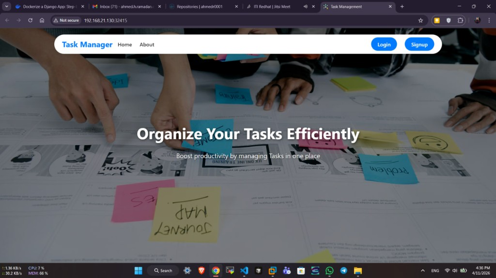
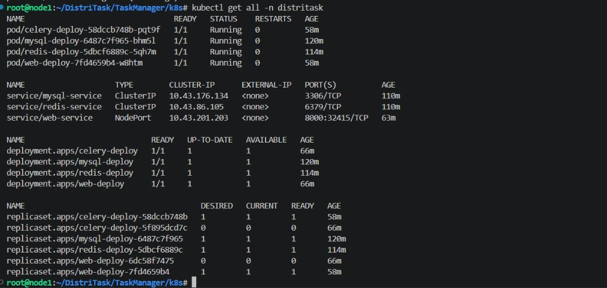

# DistriTask — Full-Stack Task Management, Containerized & Orchestrated

**DistriTask** is a portfolio-grade, full-stack task management system that demonstrates end-to-end **DevOps practice**: local **Docker / Docker Compose** containerization, then **K3s (Kubernetes)** orchestration with 12-factor-style configuration, persistence, and NodePort exposure for real cluster access.


---

## Visual proof

DistriTask served from the cluster via **NodePort** (example: `http://<node-ip>:32415`), confirming the full stack is reachable after image build/import and manifest apply.



Cluster verification: all workloads in namespace `distritask` healthy — four **Running** pods (web, Celery, MySQL, Redis), **ClusterIP** services for data tier, and **web-service** as **NodePort** `8000 → 32415`.



---

## Architecture overview

The platform is split into **four cooperating services** 🧩 (compose/K8s parity):

| Layer | Role |
|--------|------|
| **Web (Django)** | HTTP UI and API; runs migrations and seed data on startup in both Compose and K8s. |
| **Celery worker** | Background jobs using the same app image and settings as the web tier. |
| **Redis** | Celery broker (`CELERY_BROKER_URL`). |
| **MySQL 8** | Primary relational store; persistent volume in Kubernetes. |

**Orchestration:** Docker Compose for laptop/server bring-up; **K3s** for lightweight Kubernetes on a lab host (e.g. Red Hat class environment).

---

## The engineering journey

### Phase 1 — Local containerization (Docker & Docker Compose) 🐳

**Goals:** One reproducible stack for Django + Celery + Redis + MySQL, without manual migration steps every boot.

**Highlights:**

1. **Database readiness (race condition)**  
   Django and Celery start faster than MySQL. Connecting too early caused migration failures.  
   **Fix:** A `healthcheck` on the `db` service (`mysqladmin ping`) plus `depends_on` with `condition: service_healthy` for `web` and `celery`, so nothing touches the DB until MySQL accepts connections.

2. **Smaller, faster images**  
   Full Python images are heavy and slow to move.  
   **Fix:** `python:3.9-slim`, install build deps (`gcc`, `default-libmysqlclient-dev`, `pkg-config`) in one `RUN`, and `rm -rf /var/lib/apt/lists/*` to trim layer bloat.

3. **DRY single Dockerfile**  
   Web and Celery share the same codebase and dependencies.  
   **Fix:** One `dockerfile`; **no** fixed `CMD`. Compose injects `runserver` for `web` and `celery … worker` for `celery`, avoiding duplicate images/dockerfiles.

4. **Deterministic startup**  
   **Fix:** Web service command chains `migrate` → `add_data` → `runserver` so schema and demo data are applied before the server listens.

**Unified Dockerfile** (project root — commands supplied by Compose/K8s):

```dockerfile
FROM python:3.9-slim
WORKDIR /app

RUN apt-get update \
    && apt-get install -y gcc default-libmysqlclient-dev pkg-config \
    && rm -rf /var/lib/apt/lists/*

ENV PYTHONDONTWRITEBYTECODE=1
ENV PYTHONUNBUFFERED=1

RUN pip install --upgrade pip

COPY requirements.txt /app/
RUN pip install --no-cache-dir -r requirements.txt

COPY . /app/

EXPOSE 8000
# CMD omitted — web vs celery defined in docker-compose / K8s
```

**Compose orchestration** (excerpt — see `docker-compose.yml` for full file):

```yaml
services:
  db:
    image: mysql:8
    environment:
      MYSQL_DATABASE: mydatabase
      MYSQL_USER: myuser
      MYSQL_PASSWORD: mypassword
      MYSQL_ROOT_PASSWORD: myrootpassword
    volumes:
      - mysql_data:/var/lib/mysql
    healthcheck:
      test: ["CMD", "mysqladmin", "ping", "-h", "localhost", "-u", "root", "-p$$MYSQL_ROOT_PASSWORD"]
      interval: 10s
      timeout: 5s
      retries: 5

  redis:
    image: redis:alpine

  web:
    build: .
    command: >
      sh -c "python manage.py migrate &&
             python manage.py add_data &&
             python manage.py runserver 0.0.0.0:8000"
    ports:
      - "8000:8000"
    environment:
      - MYSQL_DATABASE=mydatabase
      - MYSQL_USER=myuser
      - MYSQL_PASSWORD=mypassword
      - DB_HOST=db
      - CELERY_BROKER_URL=redis://redis:6379/0
    depends_on:
      db:
        condition: service_healthy
      redis:
        condition: service_started

  celery:
    build: .
    command: ["celery", "-A", "TaskManager", "worker", "--loglevel=info"]
    environment:
      - MYSQL_DATABASE=mydatabase
      - MYSQL_USER=myuser
      - MYSQL_PASSWORD=mypassword
      - DB_HOST=db
      - CELERY_BROKER_URL=redis://redis:6379/0
    depends_on:
      db:
        condition: service_healthy
      redis:
        condition: service_started

volumes:
  mysql_data:
```

**Run locally:**

```bash
docker compose up --build
# App: http://localhost:8000
```

*(Docker Compose V1: `docker-compose up --build`.)*

---

### Phase 2 — Kubernetes orchestration (K3s) ☸️

**Goals:** Same logical architecture on K3s — isolated namespace, externalized config, secrets for credentials, durable MySQL data, and a practical way to use **locally built images** without a public registry round-trip.

**Kubernetes objects in this repo:**

| Concern | Implementation |
|--------|-----------------|
| Isolation | `Namespace` `distritask` (`k8s/namespace.yaml`) |
| Non-secret config | `ConfigMap` `backend-config` — e.g. `DB_HOST`, `CELERY_BROKER_URL`, DB name/user (`k8s/configmap.yaml`) |
| Secrets (12-factor) | `Secret` `my-secret` — MySQL passwords Base64-encoded at rest (`k8s/secret.yaml`); **replace values for real deployments** |
| MySQL persistence | `PersistentVolumeClaim` `mysql-pvc` (1Gi) + volume on `mysql-deploy` (`k8s/pvc.yaml`, `k8s/mysql-deploy.yaml`) |
| Networking | `mysql-service`, `redis-service` — stable DNS for app pods (`k8s/sql-service.yaml`, `k8s/redis-service.yaml`) |
| Workloads | `Deployment` manifests for MySQL, Redis, Django web, Celery (`k8s/*-deploy.yaml`) |

**Service discovery & startup:** Pods talk to MySQL via **`mysql-service`** and Redis via **`redis-service`**. The web deployment runs **`migrate` → `add_data` → `runserver`** before serving, aligning DB schema with the cluster DB.

**Local image bypass (no registry pull on the node):**  
Build with Docker, export a tarball, import into K3s’s containerd:

```bash
docker build -t ahmedr0001/distritask:v1 .
docker save ahmedr0001/distritask:v1 -o distritask.tar
sudo k3s ctr images import distritask.tar
```

This matches the image reference in `k8s/web-deploy.yaml` and `k8s/celery-deploy.yaml`. Adjust the tag if you use a different name.

**Expose the UI (NodePort):**  
After deployments are ready, create a NodePort Service (not stored as YAML in this repo by default):

```bash
kubectl expose deployment web-deploy \
  --name=web-service \
  --type=NodePort \
  --port=8000 \
  --target-port=8000 \
  --namespace=distritask
```

Then:

```bash
kubectl get svc -n distritask
```

Use `<node-ip>:<nodePort>` in the browser (screenshot above used a lab node IP and assigned NodePort).

---

## Deployment commands (K3s) — sequential apply

Run from the repository root on a machine with `kubectl` configured for your K3s cluster.

```bash
# 0) (On the K3s node, after building) import the app image
# docker build -t ahmedr0001/distritask:v1 .
# docker save ahmedr0001/distritask:v1 -o distritask.tar
# sudo k3s ctr images import distritask.tar

# 1) Namespace, config, secrets, storage
kubectl apply -f k8s/namespace.yaml
kubectl apply -f k8s/configmap.yaml
kubectl apply -f k8s/secret.yaml
kubectl apply -f k8s/pvc.yaml

# 2) Data layer & messaging + Services
kubectl apply -f k8s/mysql-deploy.yaml
kubectl apply -f k8s/redis-deploy.yaml
kubectl apply -f k8s/sql-service.yaml
kubectl apply -f k8s/redis-service.yaml

# 3) Application tier
kubectl apply -f k8s/web-deploy.yaml
kubectl apply -f k8s/celery-deploy.yaml

# 4) Expose Django (NodePort)
kubectl expose deployment web-deploy \
  --name=web-service \
  --type=NodePort \
  --port=8000 \
  --target-port=8000 \
  --namespace=distritask
```

---

## Operations cheat sheet

```bash
kubectl get pods -n distritask
kubectl get svc -n distritask
kubectl logs -f deployment/web-deploy -n distritask
```

---

## Repository layout (infra-focused)

| Path | Purpose |
|------|---------|
| `dockerfile` | Shared image for Django web and Celery |
| `docker-compose.yml` | Four-service local stack |
| `k8s/` | Namespace, ConfigMap, Secret, PVC, Deployments, Services |

---

## Author

**DistriTask** is maintained as a portfolio project. The infrastructure work here—Docker, Docker Compose, and Kubernetes (K3s) manifests—documents a practical path from local containers to a running multi-service deployment on a lab cluster.

---

*DistriTask — organize tasks efficiently, from a single `docker compose up` to a K3s-backed NodePort deployment.*
